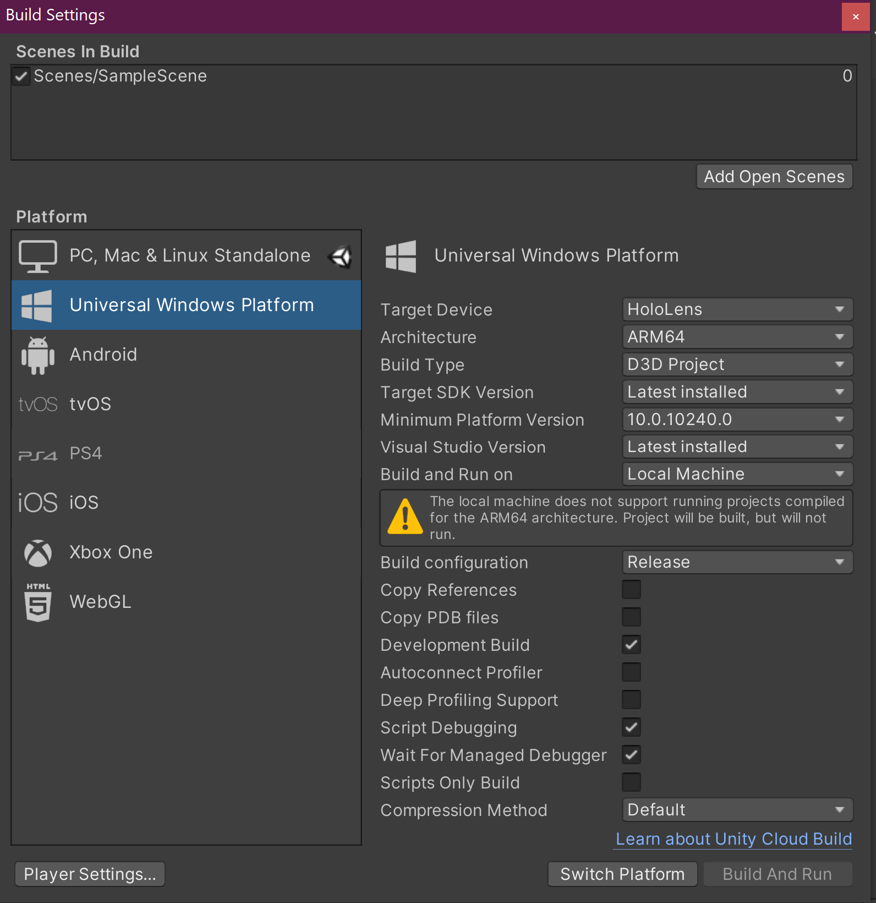
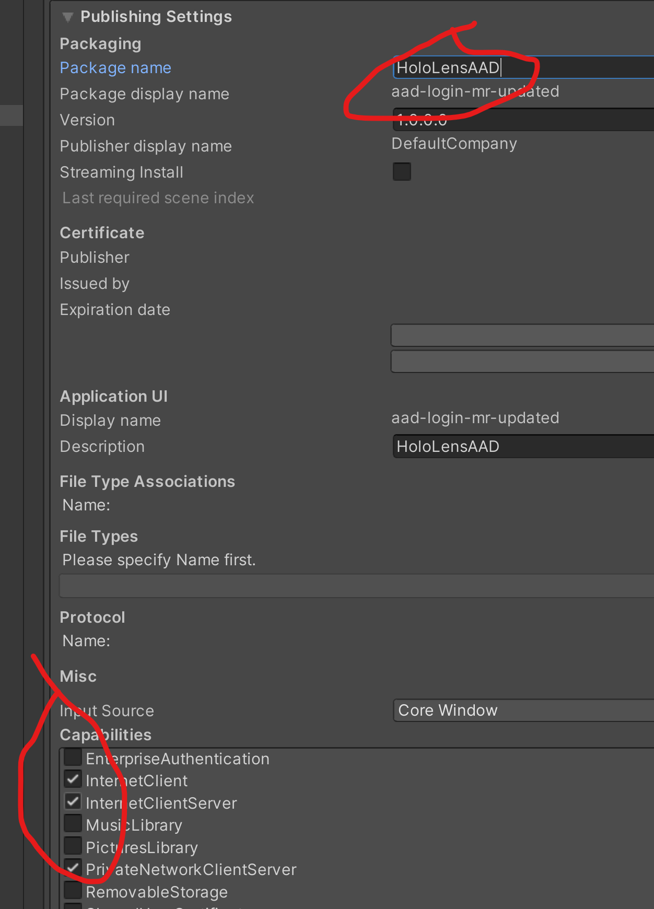
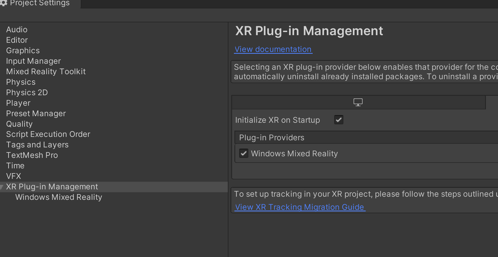
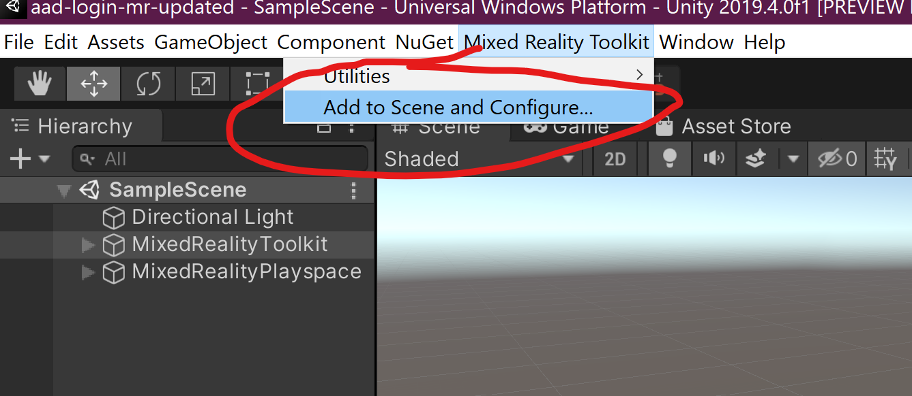
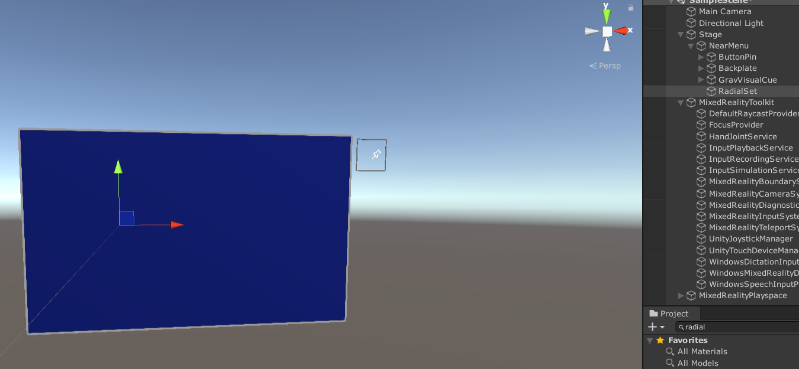
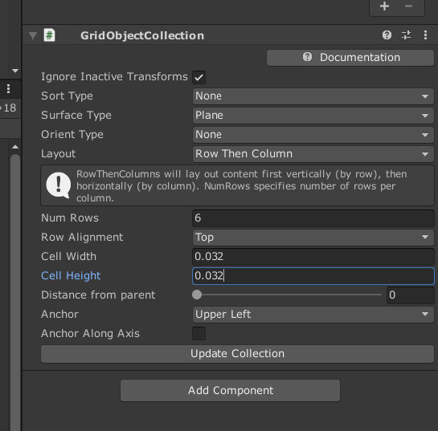
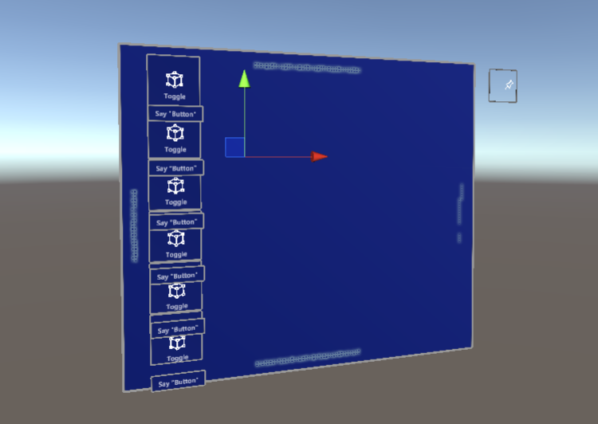
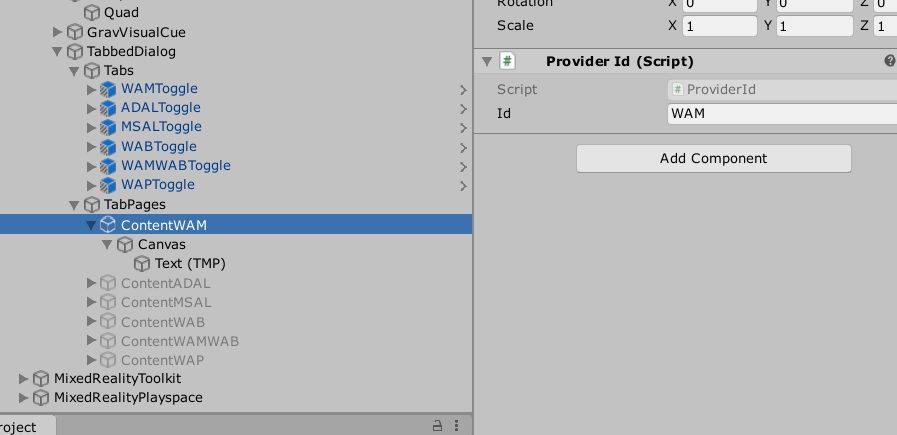
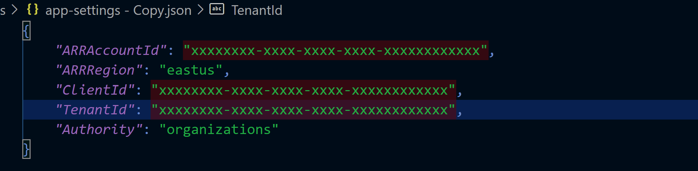
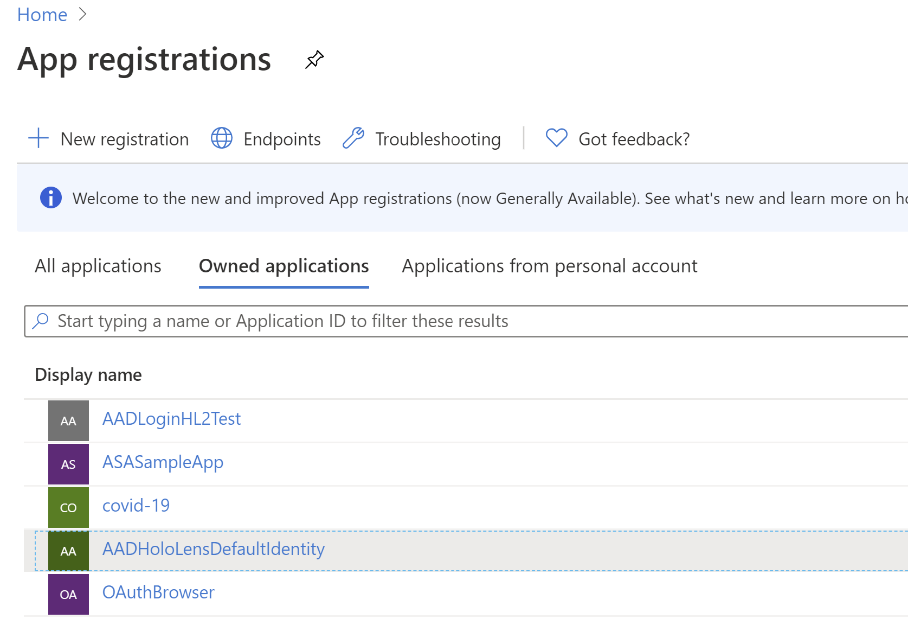

# AAD Login on HoloLens 2

I have previously written a little about the topic of retrieving Azure Active Directory (AAD) OAuth2 identity and access tokens on a HoloLens device. I focused on specific topics such as how to retrieve a token to access the Microsoft Graph API using Microsoft Authentication Library for .NET (MSAL) using the OAuth delegated flow and device code flows. You can see code and read about those <here> and <here>. There are some complications and potential blockers for those trying to set this up for the first time and, in my experience there is quite a lot of misunderstanding around the topics of auth in general. In my role at Microsoft I have worked through some of these issues for customers and I get asked a lot about how to set up auth correctly to access Graph APIs, your own APIs and Mixed Reality services. Often samples for services will skirt the issue by using secrets embedded into a client side application which you can configure with your own set of secrets for your service instances. This is fine for a demo and a first-try of the services in question but as soon as you turn your thoughts to developing production code falls down immediately and the first task you will be faced with is how to secure access to your services. I am going to cover the OAuth 2.0 Authorization Code Grant which you can read about here https://oauth.net/2/grant-types/authorization-code/ if you want to understand the details of the flow.

> In brief, the scenario I am talking about is when an end user provides permissions for an app to access services that the user has access to on their behalf. The end user does this by authenticating and consenting to a set of permissions known as scopes. The consented scopes are encapsulated within the access token itself.

I won't cover, for instance Client Credentials flow which is used in an app to service scenario not involving a user.

So, it seems pretty simple so far so why the need for this post? These are the complications that I associate with this:

- Which APIs or framework should I use?

- The acquisition of an OAuth token requires a browser doesn't it? So, how can I do this in Unity without buying a browser plugin?

- How do I configure my Azure Active Directory to access services and use role-based access control?

- I'm already logged into the HoloLens can I not just access the token already on the device?

I won't focus on some of the other topics like IL2CPP stripping code from .NET libraries as I have covered that in a previous post [IL2CPP + HoloLens](http://peted.azurewebsites.net/il2cpp-hololens/), so you may want to be on the lookout for those kind of issues. I will leave you with a code repository that you can borrow code from to set up the particular scenario that you are interested in. The code and the rest of this post will be concerned with the different ways that access and id tokens can be retrieved, back-end configuration and an illustration of how you might get an AAD token for some of the new Mixed Reality services such as Azure Spatial Anchors and Azure Remote Rendering.

<more stuff here>

## Walkthrough

For the sample I have used Unity 2019.4.0f1.
First add Nuget 2.0.0 to your project.
Then, add MRTK v2.4.0 to your project using nuget. It looks like nuget support has been dropped for MRTK v2.4.0 so download the packages and import into your project.
*build settings*
Set app package name and capabilities to allow debugging on device via the unity debugging tools so we can connect using the managed debugger
>I have trained myself to set the package name to avoid clashes with other apps I am developing

*configure*

*configure XR plugin management*

This also involves removing any legacy XR packages using the Unity package manager, if necessary..

add MRTK to the scene 

*Add MRTK*

Turn off spatial awareness by cloning the MRTK configuration and turning Enable Spatial Awareness off.
Add a near menu prefab to your scene, empty it's contents (you will need to unpack the prefab) and resize the remaining items so that the backplate is bigger, the visual cues are re-positioned and the pin is re-positioned.

*Empty NearMenu*

Find the RadialSet prefab in the MRTK and drag an instance under the near menu game object,
add a GridObjectCollection component to the RadialSet and add a toggle button for each option we want to represent (one for each login method).

Search the project panel for toggle to find the PressableButtonHoloLens2Toggle and drag one under the RadialSet.

Layout the toggle buttons

*Layout Toggle Buttons*

Adjust the backplate and grip visuals to arrive at:

*Toggle*

Rename and configure toggle buttons in the InteractableToggleCollection component on the RadialSet

*Interactable*

Then we are going to make this into a tabbed dialog by adding a parent node to the RadialSet (I called this TabbedDialog) and then adding a script to that node. Here's a snippet from TabbedDialog.cs showing how the content visibility is synchronised with the tab selection.

```C#
    private void OnSelectedChanged()
    {
        // Retrieve the current Index here...
        var newId = SyncPanelToCurrentIndex();
        if (!string.IsNullOrEmpty(newId))
            SelectedChanged.Invoke(newId);
    }

    private void OnEnable()
    {
        if (_selectionChanged == null)
            _selectionChanged = OnSelectedChanged;

        tabs.OnSelectionEvents.AddListener(_selectionChanged);
        SyncPanelToCurrentIndex();
    }

    string SyncPanelToCurrentIndex()
    {
        int idx = tabs.CurrentIndex;
        if (idx < 0 && idx >= Panels.Length)
            return string.Empty;

        foreach (var panel in Panels)
        {
            panel.SetActive(false);
        }

        Panels[idx].SetActive(true);
        return Panels[idx].GetComponent<ProviderId>().Id;
    }
```

The content pages are arbitrary game objects and are given an ID by adding the ProviderId script. This way the ID can be passed around to switch the content page and also the Identity provider.

*Content Pages*

The video below shows the tabbed dialog being used to switch the content pages in the Unity Game preview.

<figure class="video_container">
<iframe src="https://www.youtube.com/embed/cOxb61Tk1hM"  frameborder="0" allowfullscreen="true"></iframe>
</figure>

We can use this UI to plug in different auth providers and switch them at runtime.

## APIs and Frameworks

### Web Authentication Manager

### Windows Account Provider

### Microsoft Authentication Library

### Active Directory Authentication Library

When we first try to use ADAL we get hit with the following error:

> Error on deserializing read-only members in the class: No set method for property 'TenantDiscoveryEndpoint' in type 'Microsoft.IdentityModel.Clients.ActiveDirectory.InstanceDiscoveryResponse'.

This looks suspiciously like an IL2CPP code stripping issue. This occurs as byproduct of the optimisation used when the .NET binary is converted to C++. Unused code is stripped out in that process and sometimes code that isn't detected as reachable gets removed. Look out for code that is only referenced in a reflection scenario. See [here](http://peted.azurewebsites.net/il2cpp-hololens/) for further details. The short answer is to add a link.xml stating which types to not strip.

link to the link.xml

### Windows Authentication Broker

## Settings

The settings for auth are stored in a json file in the Assets folder



So edit this file with your own settings and rename it to app-settings.json and the sample code will pick it up.

## Configure the Backend

It is worth scanning the docs [here](https://docs.microsoft.com/en-us/hololens/hololens-identity) and although we can see from those docs that you can login to your HL2 with a local account or an MSA things get more interesting when we consider Azure Active Directory because at the time of writing it is possible to have 64 AAD user accounts with the following options:

- Azure web credential provider
- Azure Authenticator App
- Biometric (Iris) – HoloLens 2 only
- PIN – Optional for HoloLens (1st gen)required for HoloLens 2
- Password

Of most interest to me being iris login with multiple accounts.

> Just getting an OAuth token and displaying it isn't too interesting as really the aim in a real app would most-likely be to access a custom API or some other Azure resource. So, to show that things are working as expected we'll take the AAD token and exchange it for and access token for Azure Mixed Reality services. We'll use that access token to make a call to the Azure Remote Rendering Service to enumerate rendering sessions just to check that the call succeeds. This access token could be used to access any MR services, e.g. Azure Spatial Anchors, that the logged in user has access to. We'll look into how to configure the application and also provide access to a particular user next.

### Register the App

I've covered this a few times on my blog so will just include the basic steps here:

In the [Azure portal](https://portal.azure.com) if you don't have an AAD set up there is a quickstart [here](https://docs.microsoft.com/en-us/azure/active-directory/develop/quickstart-create-new-tenant) to help get you up and running. Once created you can register a new application:



Select 'New Registration' and just name it without worrying about the other settings. You will be shown a page which has settings that you will need for the app-settings.json file we mentioned above (maybe fill those now). The other important thing is to register a redirect uri for your app.

### Redirect URI

The easiest way to discover the redirect URI for the sample app is to run it and the app will write the uri to th unity log.

> Note, that the running instance of your app needs to be terminated before the log is flushed. You can terminate the app and download the unity log using the [HoloLens device portal](https://docs.microsoft.com/en-us/windows/mixed-reality/using-the-windows-device-portal).

This code:

```C#
string URI = string.Format("ms-appx-web://Microsoft.AAD.BrokerPlugIn/{0}", WebAuthenticationBroker.GetCurrentApplicationCallbackUri().Host.ToUpper());
Logger.Log("Redirect URI: " + URI);
```

will log out a redirect URI for a UWP app.

> If I have this right the ADAL implementation required a slightly different format so I registered both:

```C#
string URI = string.Format("ms-app://{0}", WebAuthenticationBroker.GetCurrentApplicationCallbackUri().Host.ToUpper());
Logger.Log("Redirect URI: " + URI);
```
