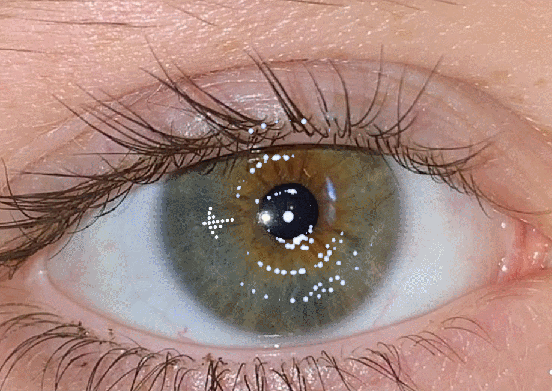
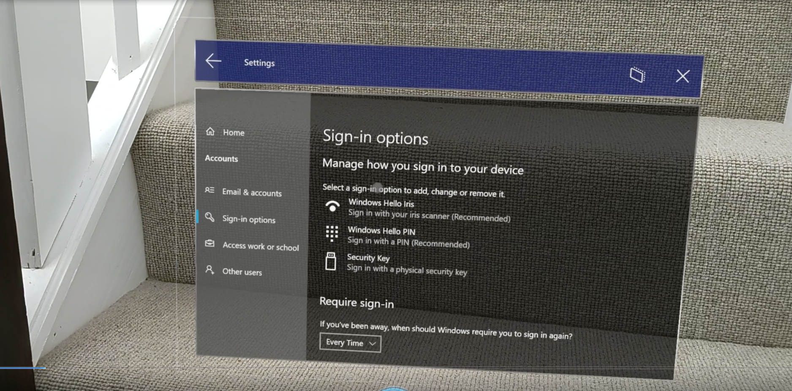

# AAD Login on HoloLens 2

Here's a short video of the sample app that goes with this post:

The code is on GitHub: https://github.com/peted70/aad-hololens

One of the coolest aspects of HoloLens 2 is the iris login as it avoids typing on a virtual keyboard. Although hand-tracked typing is also a useful feature, it can become tiring.

This repository shows how to set up your HoloLens 2 device using AAD credentials and configure the device to use iris login.

## Sample Walkthrough

(Shortened for clarity in repository README)

For full details and code snippets, see the original README content in the repository.

---

## License

This project is available under the MIT License. See [LICENSE](LICENSE) for details.
